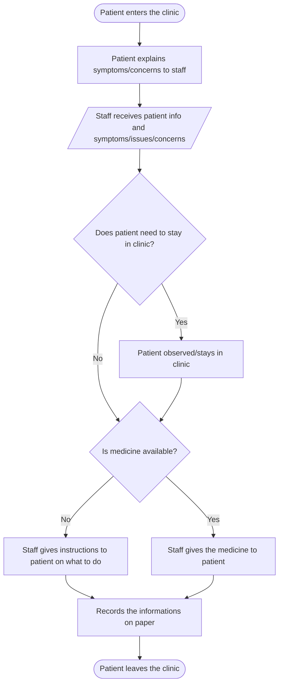

```mermaid
flowchart TD
    %% Start
    A([Patient enters the clinic]) --> B[Patient explains symptoms/concerns to staff]
    
    %% Input/Output symbol for patient-provided info
    B --> C[/Staff receives patient info and symptoms/issues/concerns/]
    
    %% Assessment
    C --> D{Does patient need to stay in clinic?}
    
    %% Patient does not stay
    D -- No --> E{Is medicine available?}
    E -- No --> F[Staff gives instructions to patient on what to do]
    F --> K
    
    %% Patient stays
    D -- Yes --> H[Patient observed/stays in clinic]
    H --> E

    E -- Yes --> J[Staff gives the medicine to patient]
    J --> K[Records the informations on paper]
    K --> G([Patient leaves the clinic])
```
